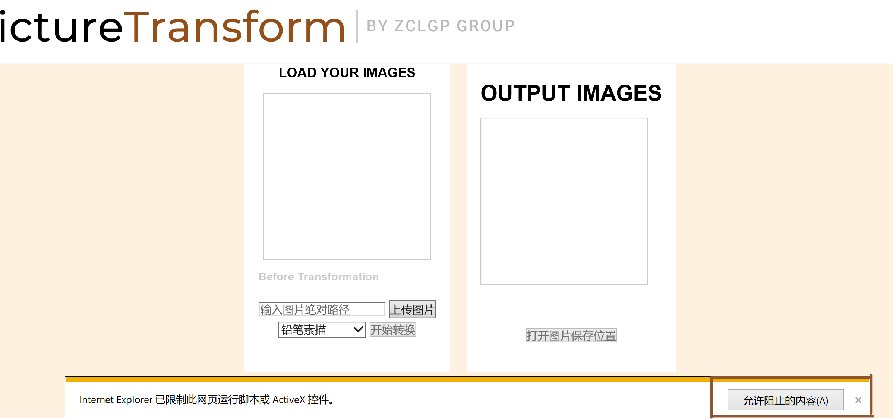
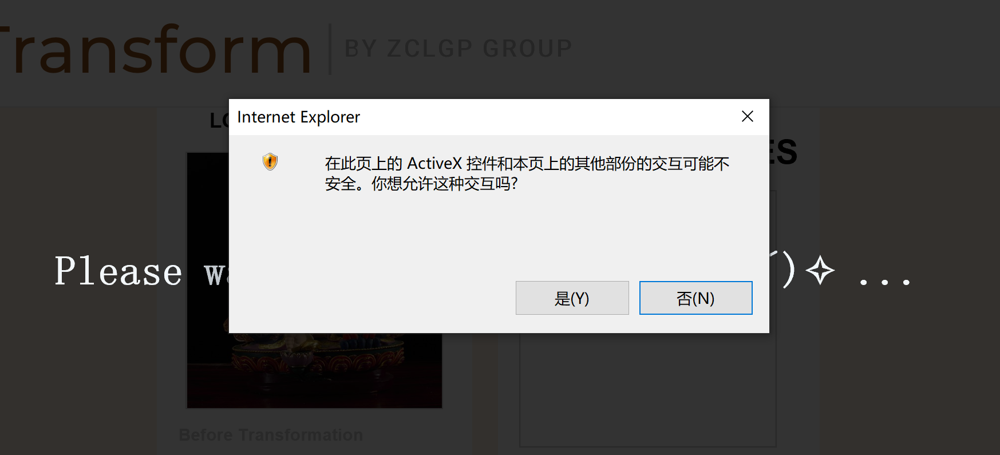
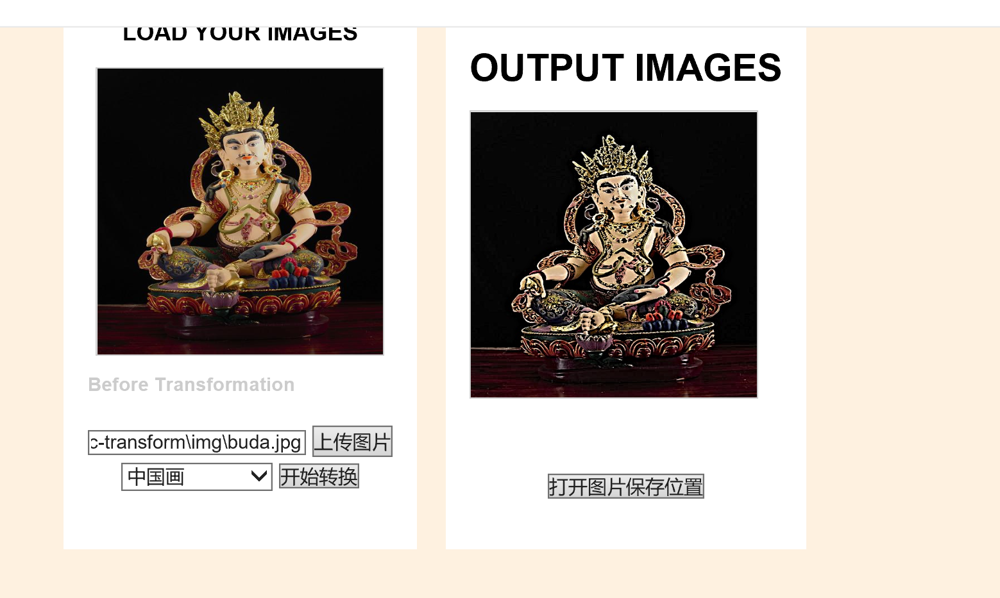
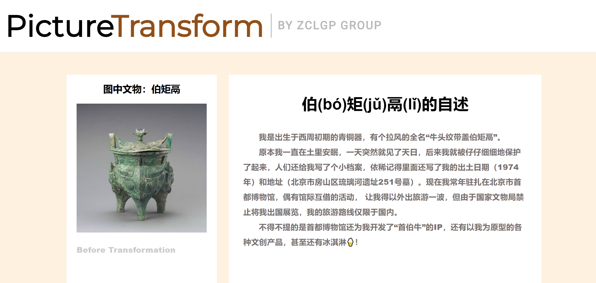
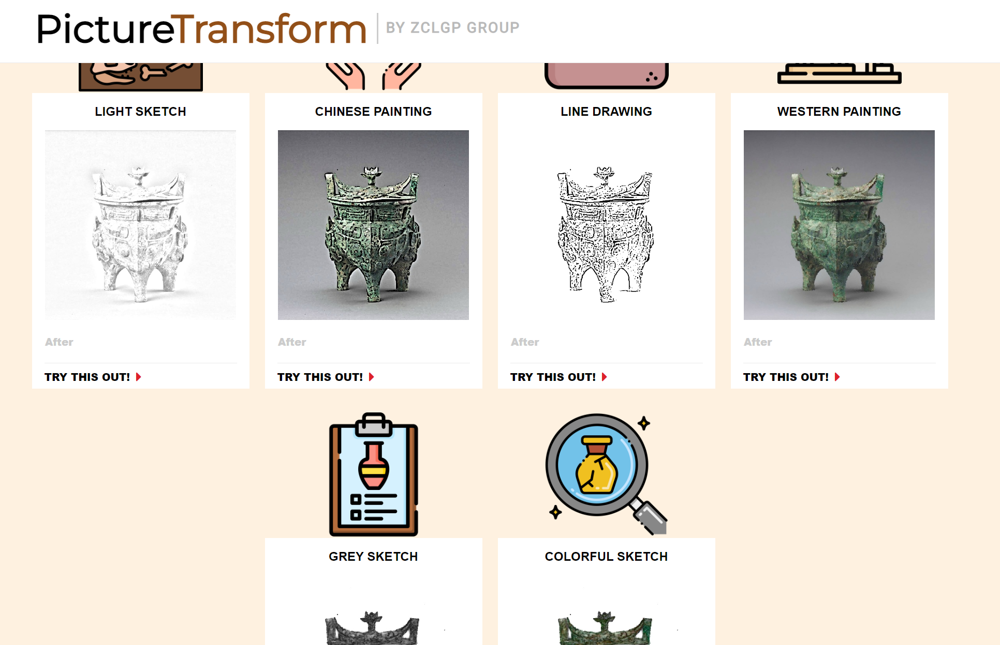

# Pic_trans

## 1.功能简介

利用opencv库实现实物图转为风格画，目前支持的转化包括：

- 铅笔素描
- 中国画
- 白描工笔画
- 油画
- 单色木炭素描
- 彩色木炭素描

## 2.网页交互

### 2.1 环境配置与运行方式

#### 2.1.1 面向用户

我们小组将python文件打包为可执行的exe文件，用户无需额外配置python环境，可直接克隆仓库后在本地访问index.html网页，直接在网页导引下实现图片转换。

**网页需使用IE浏览器打开，或使用IE浏览器内核**。进入图片转换页面后单击“允许阻止的内容”。



输入图片绝对路径后选取模式，点击开始转换后弹出窗口，点击允许，进行图片后台转换。



转换完成后可点击“查看图片保存位置”在文件夹内打开保存的图片。



#### 2.1.2 面向开发者

需安装依赖库opencv。

直接使用命令行运行python文件（速度较运行exe文件更快，若需运行exe文件也需提供如下参数）：

```bash
python trans-pic.py -op [操作类型，1~6] -p [待转换图片路径] - sp [图片保存路径]
```

### 2.2 效果展示

首页面，文物介绍与转换图效果一览：





点击`try this out！`进入图片转换页面（效果与具体操作见2.1.1部分）

## 3. 图形界面交互

### 3.1 环境配置

为便于用户操作，小组还使用qt库编写了图形界面，并将之转换为可执行文件qt_pic_trans.exe供用户使用。此图形界面无需配置任何环境。
(注：由于pyinstaller对于open-cv库的打包存在bug，所以当前mac用户运行
该应用程序可能出现问题)
运行程序前需要您在本地保存一张.jpg格式图片。

### 3.2 效果展示
(1) 双击打开 qt_pic_trans.exe 出现如下程序界面：
![[pic_trans_window.png]](img/pic_trans_window.png)

(2) 单击“添加文件”选择你在本地准备好的xxx.jpg图片文件
(3) 单击“添加文件夹”选择您希望将风格转换后的图片保存的位置
(如果您只希望预览图片风格转换后的效果而不希望将结果保存到
本地，不选择“添加文件夹”这项即可)

(4) 选择好本地文件与保存路径之后，分别点击下方六种转换风格即可
预览各个风格转换的结果（同时自动将结果保存在了您指定的路径下）
例如：点击“白描”按钮效果如下：
![[xiaoguotu1.png]](img/xiaoguotu1.png)

(5) 点击某个风格之后程序不会退出，您可以继续尝试其它风格。

## 4.致谢

网页框架参考： [ThoughCo with Scaffold](https://fcarlosdev.github.io/thoughco/)

图片来源：[伯矩鬲](https://ts1.cn.mm.bing.net/th/id/R-C.3f742f804a8f57ec6df0533ad8c644ec?rik=SbdRK3HwQK2mYQ&riu=http%3a%2f%2fwww.wenbozaixian.com%2fdata%2fupload%2f20161224%2f585dd368f0243.png&ehk=QjnSMbElfb3FSRLImS17J9vxJrotnVZZt58sQvf%2f4AU%3d&risl=&pid=ImgRaw&r=0)

## 5.未完待续...

- 直接进行html与python的交互，实现让用户直接选取图片（而非使用绝对路径的形式）。
  本版代码以传参的形式将图片地址传给python，故需得到用户图片的完整路径，而若在html中使用file类型的input选取图片，处于安全因素将无法获得图片完整路径。
- 将html转换为exe。
  本版代码能否正常运行与各个文件的相对路径是否发生相对变化有关，倘使用户不慎移动文件可能导致网页无法渲染或图片无法转换。后续考虑将各个文件打包为exe，用户无需考虑文件路径问题。
- 当前图形界面还比较粗糙，比如无法根据用户显示屏大小调整界面大小，导致部分用户的界面上
显示字体不清晰，后序将进一步美化图形界面，并添加一些功能，
